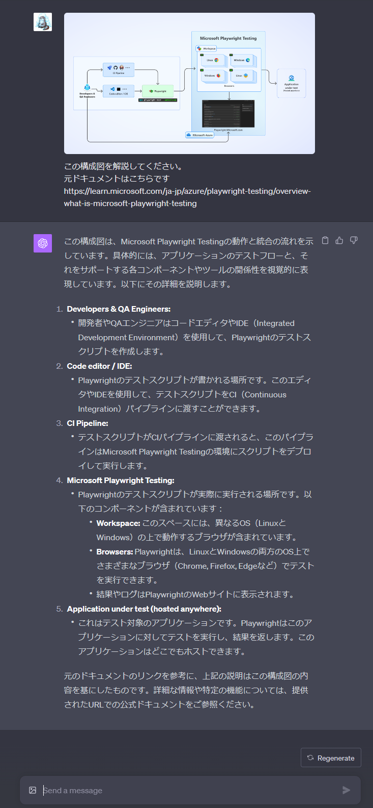
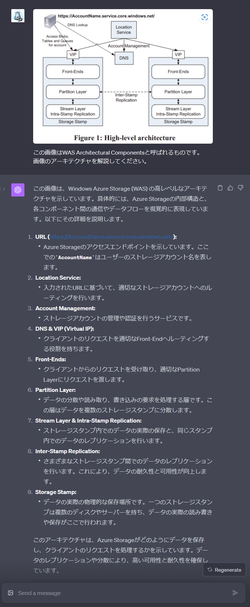

# はじめに
ChatGPTの有料会員向けにマルチモーダル機能が実装されたのでさっそく検証してみました。
GPT-4Vは、ChatGPT PlusとEnterpriseのユーザー向けに提供され、ChatGPTに画像をアップロードすることで、画像の内容を分析し、それに関連する情報や質問に答えることもできます。

https://openai.com/blog/chatgpt-can-now-see-hear-and-speak

# 構成図の解説
はじめにやろうと思ったのはアーキテクチャ図のような構成図の解説です。  
例に以下のMicrosoft Playwright Testingの構成図を解説してもらいます。

https://learn.microsoft.com/ja-jp/azure/playwright-testing/overview-what-is-microsoft-playwright-testing

構成図の内容を詳しく解説してくれました。  
ドキュメントを参照させていることもありますが、構成図の内容について詳しく説明してくれています。

# 論文の画像説明
論文に挿入されている構成図なども解説してもらうことができました。
試しに以下の論文の図１を解説してもらいました。

https://www.cs.purdue.edu/homes/csjgwang/CloudNativeDB/AzureStorageSOSP11.pdf

WAS (Windows Azure Storage)について
各線上に指示している内容を中心に解説してくれています。

# おわりに
このように、画像を読み込ませることでドキュメントや論文に出てくる構成図やアーキテクチャ図を簡単に理解できるようになることが分かりました。今後も活用していきたいと思います！